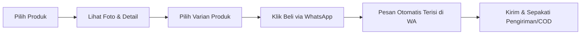

# 📖 BUKU PANDUAN PENGGUNAAN WEBSITE
## Direktori & Katalog UMKM Desa Kedungsumur

Selamat datang di Panduan Resmi Penggunaan Website **UMKM Desa Kedungsumur**. Dokumen ini dirancang sebagai petunjuk operasional lengkap, terstruktur, dan mudah dipahami oleh dua kelompok pengguna utama:
1. **Pengunjung / Client (Warga Masyarakat & Calon Pembeli)**: Panduan mencari UMKM, menjelajahi katalog produk lokal, memeriksa sertifikasi usaha, dan memesan produk secara langsung ke penjual via WhatsApp.
2. **Administrator (Perangkat Desa & Pengelola BUMDes)**: Panduan mengelola portal, memoderasi profil UMKM desa, memperbarui katalog dan foto produk, mengatur varian dagangan, hingga mengelola kredensial keamanan.

---

## 📑 DAFTAR ISI

- [1. Gambaran Umum Sistem & Navigasi](#1-gambaran-umum-sistem--navigasi)
- [2. Panduan untuk Pengunjung / Client](#2-panduan-untuk-pengunjung--client)
  - [2.1 Menjelajahi Beranda Utama (`/`)](#21-menjelajahi-beranda-utama-)
  - [2.2 Mencari dan Menyaring Direktori UMKM (`/umkm`)](#22-mencari-dan-menyaring-direktori-umkm-umkm)
  - [2.3 Melihat Profil & Kontak Pelaku Usaha (`/umkm/[id]`)](#23-melihat-profil--kontak-pelaku-usaha-umkmid)
  - [2.4 Menjelajahi Katalog Produk Desa (`/produk`)](#24-menjelajahi-katalog-produk-desa-produk)
  - [2.5 Langkah Melakukan Pemesanan via WhatsApp (`/produk/[id]`)](#25-langkah-melakukan-pemesanan-via-whatsapp-produkid)
- [3. Panduan untuk Administrator](#3-panduan-untuk-administrator)
  - [3.1 Akses Masuk & Login Panel Admin (`/admin`)](#31-akses-masuk--login-panel-admin-admin)
  - [3.2 Memahami Dashboard Overview](#32-memahami-dashboard-overview)
  - [3.3 Manajemen Data UMKM Desa (`/admin/umkm`)](#33-manajemen-data-umkm-desa-adminumkm)
    - [A. Menambah Profil UMKM Baru](#a-menambah-profil-umkm-baru)
    - [B. Mengubah (Edit) Informasi UMKM](#b-mengubah-edit-informasi-umkm)
    - [C. Menyesuaikan Status Buka / Tutup Toko](#c-menyesuaikan-status-buka--tutup-toko)
    - [D. Menghapus UMKM](#d-menghapus-umkm)
  - [3.4 Manajemen Katalog Produk Desa (`/admin/products`)](#34-manajemen-katalog-produk-desa-adminproducts)
    - [A. Menambah Produk Baru](#a-menambah-produk-baru)
    - [B. Mengelola Varian Produk](#b-mengelola-varian-produk)
    - [C. Mengunggah & Mengatur Galeri Foto Produk](#c-mengunggah--mengatur-galeri-foto-produk)
    - [D. Menetapkan Produk Unggulan (*Featured*)](#d-menetapkan-produk-unggulan-featured)
    - [E. Mengubah dan Menghapus Produk](#e-mengubah-dan-menghapus-produk)
  - [3.5 Reset Data ke Kondisi Awal Desa (*Factory Reset*)](#35-reset-data-ke-kondisi-awal-desa-factory-reset)
  - [3.6 Mengganti Username & Password Admin](#36-mengganti-username--password-admin)
  - [3.7 Keluar dari Panel Admin (*Logout*)](#37-keluar-dari-panel-admin-logout)
- [4. Tanya Jawab & Pemecahan Masalah (FAQ)](#4-tanya-jawab--pemecahan-masalah-faq)

---

## 1. GAMBARAN UMUM SISTEM & NAVIGASI

Website Direktori & Katalog UMKM Desa Kedungsumur hadir untuk mendigitalkan potensi produk usaha lokal. Melalui platform ini:
- **Calon pembeli** dapat menemukan produk berkualitas dan memesan langsung tanpa perantara komisi yang memberatkan pelaku usaha.
- **Pelaku usaha desa** mendapatkan etalase digital profesional dengan sertifikasi terverifikasi.
- **Pemerintah desa / Admin** dapat mendata perkembangan ekonomi mikro secara terpusat dan akurat.

### Struktur Navigasi Website:
| Halaman | Akses | Fungsi Utama |
| :--- | :--- | :--- |
| **Beranda (`/`)** | Publik | Sorotan produk desa, pencarian cepat, statistik, UMKM unggulan. |
| **Direktori UMKM (`/umkm`)** | Publik | Daftar lengkap toko lokal, filter bidang kategori, urutan A-Z/terbaru. |
| **Detail UMKM (`/umkm/[id]`)** | Publik | Profil usaha, sertifikasi (Halal/PIRT/dll), peta rute, kontak medsos & produk toko. |
| **Katalog Produk (`/produk`)** | Publik | Seluruh etalase produk, filter harga & rating, sorting terpopuler. |
| **Detail Produk (`/produk/[id]`)** | Publik | Galeri foto, deskripsi, pilihan varian, dan tombol pemesanan instan WhatsApp. |
| **Panel Admin (`/admin`)** | Terproteksi | Dashboard moderasi, manajemen toko, penambahan produk, dan pengaturan akun. |

---

## 2. PANDUAN UNTUK PENGUNJUNG / CLIENT

Sebagai pengunjung atau calon pembeli, Anda tidak diwajibkan mendaftar akun atau mengingat kata sandi. Seluruh fitur pencarian dan pemesanan dapat diakses dengan cepat.

---

### 2.1 Menjelajahi Beranda Utama (`/`)

1. **Banner Promosi Dinamis**:
   - Di bagian paling atas, terdapat spanduk berganti (*carousel*) yang memperkenalkan keunggulan desa dan produk khas pilihan.
2. **Pencarian Cepat (*Search Box*)**:
   - Ketikkan barang yang Anda cari (misal: `keripik`, `batik`, `kopi`, `madu`) atau nama pemilik toko pada kotak pencarian beranda.
   - Tekan tombol **Cari** atau tekan tombol Enter pada keyboard untuk melihat daftar hasil pencarian.
3. **Statistik Perekonomian Desa**:
   - Kotak angka bergerak menunjukkan jumlah UMKM aktif yang siap melayani, banyaknya variasi produk lokal, dan sertifikasi resmi yang telah dikantongi para pelaku usaha.
4. **Pintasan Kategori Usaha**:
   - Klik kartu kategori seperti **Kuliner**, **Kerajinan**, **Pertanian**, **Fashion**, atau **Jasa** untuk langsung menyaring jenis usaha yang Anda inginkan.
5. **Koleksi UMKM Terbaru**:
   - Bagian bawah menampilkan kartu UMKM yang baru bergabung, lengkap dengan foto banner dan jumlah produk yang mereka tawarkan.

---

### 2.2 Mencari dan Menyaring Direktori UMKM (`/umkm`)

Klik menu **"Direktori UMKM"** pada bilah navigasi atas (di HP: klik ikon menu tiga garis).

1. **Kolom Pencarian**:
   - Masukkan kata kunci nama toko, nama pemilik, atau nama dusun di Desa Kedungsumur.
2. **Filter Berdasarkan Kategori**:
   - Klik tombol kategori (misal: *Semua Kategori*, *Kuliner*, *Kerajinan*, dll.) untuk menyaring toko yang bergerak di bidang tersebut.
3. **Pilihan Urutan (*Sorting*)**:
   - Gunakan menu dropdown untuk memilih urutan:
     - **Terbaru**: Menampilkan UMKM yang baru terdaftar di sistem.
     - **Nama A-Z**: Mengurutkan nama UMKM secara alfabetis.
     - **Nama Z-A**: Mengurutkan nama UMKM dari abjad terakhir.
4. **Memahami Kartu UMKM**:
   - Setiap kartu menampilkan foto etalase, kategori usaha, nama toko, nama pemilik, alamat ringkas, dan label status (*Buka / Tutup*).
   - Klik kartu untuk membuka profil lengkap UMKM tersebut.

---

### 2.3 Melihat Profil & Kontak Pelaku Usaha (`/umkm/[id]`)

Halaman profil UMKM menyediakan informasi komprehensif mengenai latar belakang toko:

1. **Legalitas & Sertifikasi Resmi**:
   - Perhatikan badge sertifikasi di sebelah profil toko. Pelaku usaha terverifikasi memiliki label seperti:
     - **Halal (MUI / BPJPH)**
     - **P-IRT (Pangan Industri Rumah Tangga)**
     - **NIB (Nomor Induk Berusaha)**
     - **BPOM**
2. **Riwayat Usaha & Filosofi**:
   - Memuat cerita otentik tentang bagaimana usaha tersebut dirintis dan nilai khas produknya.
3. **Alamat Fisik & Petunjuk Arah**:
   - Tercantum alamat lengkap dan jam buka operasional.
   - Klik tombol **"Buka Petunjuk Arah (Peta)"** untuk membuka aplikasi Google Maps dan memandu perjalanan Anda ke lokasi toko.
4. **Kanal Komunikasi Lengkap**:
   - **WhatsApp**: Membuka percakapan chat WhatsApp langsung dengan pemilik.
   - **Telepon GSM**: Melakukan panggilan seluler langsung.
   - **Media Sosial**: Ikon tautan langsung menuju Instagram, Facebook, TikTok, atau Website resmi pelaku usaha.
5. **Katalog Khusus Toko Terkait**:
   - Gulir ke bawah untuk melihat semua produk yang diproduksi dan dijual oleh toko tersebut.

---

### 2.4 Menjelajahi Katalog Produk Desa (`/produk`)

Klik menu **"Katalog Produk"** untuk melihat etalase belanja desa secara menyeluruh.

1. **Filter Fleksibel**:
   - **Pencarian**: Cari berdasarkan nama makanan, kerajinan, atau bahan mentah.
   - **Kategori**: Pilih bidang kategori barang.
   - **Urutan Pilihan**:
     - *Rating Tertinggi*: Menampilkan produk dengan penilaian kepuasan konsumen terbaik.
     - *Harga Terendah*: Urutan produk dari yang paling ekonomis.
     - *Harga Tertinggi*: Urutan produk dari yang paling eksklusif.
     - *Paling Populer*: Produk yang paling banyak dilihat oleh pengunjung lain.
2. **Label Produk Unggulan**:
   - Produk berlabel bintang emas merupakan produk unggulan rekomendasi desa yang menjadi daya tarik utama daerah.
3. **Informasi Harga Jelas**:
   - Harga dicantumkan secara transparan beserta satuan barangnya (misal: `Rp 15.000 / pcs`, `Rp 30.000 / botol`, `Rp 50.000 / kg`).

---

### 2.5 Langkah Melakukan Pemesanan via WhatsApp (`/produk/[id]`)

Pemesanan produk di website ini mengedepankan kemudahan dan kenyamanan belanja langsung (*direct to seller*):



1. **Buka Halaman Detail Produk**:
   - Klik produk yang ingin Anda beli dari Katalog atau Profil Toko.
2. **Lihat Galeri Foto Interaktif**:
   - Klik foto-foto kecil untuk melihat produk dari berbagai sudut.
   - Klik gambar utama untuk membuka mode **Lightbox (Perbesar Foto Penuh)**. Anda dapat memperbesar (*zoom*) detail kerapian produk.
3. **Pilih Varian yang Diinginkan**:
   - Jika produk menyediakan beberapa opsi (contoh: *Original*, *Pedas Level 2*, *Kemasan 250gr*, *Kemasan 500gr*), klik pada salah satu kotak varian yang diinginkan hingga muncul tanda centang (✓).
4. **Klik Tombol "Beli Sekarang via WhatsApp"**:
   - Tombol berwarna hijau WhatsApp akan secara otomatis menyusun pesan siap kirim.
   - Contoh format pesan yang dibuat otomatis oleh website:
     > *"Halo, saya tertarik untuk membeli produk 'Kopi Robusta Asli Kedungsumur' (Varian: Bubuk Halus 250gr) dari toko 'Kopi Berkah Abadi'. Apakah stok varian ini masih tersedia?"*
5. **Kirim Pesan ke Penjual**:
   - Aplikasi WhatsApp akan otomatis terbuka di smartphone Anda (atau WhatsApp Web di komputer/laptop).
   - Tekan tombol **Kirim**.
   - Diskusikan alamat pengantaran, ongkos kirim (jika luar desa), atau buat janji temu / bayar di tempat (COD) langsung dengan penjual.

> 💡 **Tips Pengunjung**: Gunakan tombol ikon **WhatsApp Melayang (Floating WA)** di pojok kanan bawah layar untuk menghubungi penjual secara instan kapan saja selama berada di halaman toko atau produk.

---

## 3. PANDUAN UNTUK ADMINISTRATOR

Bagian ini ditujukan bagi Administrator Desa, Pengurus BUMDes, atau pengelola komunitas yang bertugas menjaga kebaruan data UMKM dan produk lokal.

---

### 3.1 Akses Masuk & Login Panel Admin (`/admin`)

1. Buka browser dan arahkan ke alamat URL:
   ```text
   http://<nama-domain-atau-ip-website>/admin
   ```
2. Anda akan disambut halaman **Login Administrator** yang aman:
   - Masukkan **Username** akun admin.
   - Masukkan **Password** akun admin.
3. Klik tombol **"Masuk ke Dashboard"**.
4. **Proteksi Keamanan Berlapis**:
   - Sistem dilengkapi pembatasan *Anti-Brute Force*: Jika salah memasukkan kata sandi 5 kali berturut-turut, akses login akan dibekukan sementara selama 15 menit.
   - Sesi login disimpan dalam cookie berstandar tinggi (*HttpOnly & SameSite Strict*) yang tidak dapat dibajak oleh skrip peramban luar.

---

### 3.2 Memahami Dashboard Overview

Setelah berhasil masuk, Anda berada di halaman **Dashboard Utama**:
1. **Kartu Indikator Statistik**:
   - **Total UMKM Terdaftar**: Menampilkan jumlah toko dan statusnya (misal: 10 Buka).
   - **Total Produk Katalog**: Menampilkan jumlah produk aktif dan jumlah produk berstatus unggulan.
2. **Tombol Aksi Cepat (*Quick Actions*)**:
   - `+ Tambah UMKM Baru`: Membuka formulir pendaftaran usaha warga dalam satu klik.
   - `+ Tambah Produk Baru`: Membuka formulir pengunggahan produk baru.
3. **Tabel Ringkasan Populer**:
   - Menampilkan 5 produk yang paling sering dilihat oleh calon pembeli beserta status tokonya.
   - Menampilkan daftar singkat UMKM terbaru yang siap ditinjau.

---

### 3.3 Manajemen Data UMKM Desa (`/admin/umkm`)

Buka menu **"Kelola UMKM"** pada bilah navigasi admin.

#### A. Menambah Profil UMKM Baru
1. Klik tombol hijau **"+ Tambah UMKM Baru"** di kanan atas.
2. Isi formulir yang muncul dengan teliti:
   - **Nama UMKM**: Nama merek atau nama warung/toko (Wajib diisi).
   - **Nama Pemilik**: Nama warga pengelola usaha (Wajib diisi).
   - **Kategori**: Pilih bidang usaha (*Kuliner*, *Kerajinan*, *Pertanian*, *Jasa*, atau *Fashion*).
   - **Tahun Berdiri**: Tahun awal usaha dirintis (Contoh: `2018`).
   - **Status Operasional**: Pilih `Aktif Beroperasi` atau `Tutup Sementara`.
   - **Alamat Lengkap**: Tuliskan alamat jelas (Dusun, RT/RW di Kedungsumur).
   - **Jam Operasional**: Jam dan hari buka (Contoh: `08.00 – 17.00 WIB (Senin – Sabtu)`).
   - **Koordinat Peta (Opsional)**:
     - Masukkan nilai **Latitude** (garis lintang, contoh: `-7.123456`) dan **Longitude** (garis bujur, contoh: `112.543210`).
     - Hal ini akan mengaktifkan tombol petunjuk arah akurat di Google Maps bagi pembeli.
   - **Deskripsi & Kisah Usaha**: Tuliskan deskripsi produk yang dijual dan cerita singkat perjuangan toko untuk menarik simpati dan minat konsumen.
   - **Banner / Foto Profil UMKM**:
     - *Opsi 1 (Upload File)*: Klik tombol pilih file untuk mengunggah foto dari HP/Laptop Anda (Ukuran maksimal: **5 MB**, format JPG/PNG/WebP).
     - *Opsi 2 (Tautan URL)*: Ketik alamat URL gambar eksternal lalu klik tombol *"Gunakan URL"*.
   - **Kontak & Komunikasi**:
     - **WhatsApp**: Masukkan nomor WhatsApp pemilik. Sangat dianjurkan menggunakan format internasional berawalan `62` tanpa tanda tambah atau spasi (Contoh: `6281234567890`).
     - **Telepon GSM, Email, Website**: Masukkan jika tersedia.
     - **Media Sosial**: Masukkan nama pengguna atau tautan akun Facebook, Instagram, dan TikTok.
   - **Sertifikasi Resmi**:
     - Masukkan nama sertifikat legal yang dimiliki usaha tersebut.
     - **Penting**: Masukkan **satu sertifikasi per baris** (tekan tombol Enter).
     - Contoh:
       ```text
       Sertifikat Halal ID3511000123456
       P-IRT No. 2063515010203-26
       Nomor Induk Berusaha (NIB)
       ```
3. Klik tombol **"Simpan UMKM"**. Data akan langsung tersimpan di database dan tayang ke publik.

#### B. Mengubah (Edit) Informasi UMKM
1. Gunakan bilah pencarian atau filter kategori untuk mencari toko yang ingin diperbarui.
2. Pada tabel, klik tombol **"Edit"** (ikon pensil ✏️).
3. Formulir akan otomatis terisi dengan data lama toko tersebut.
4. Lakukan penyesuaian (misal: mengganti nomor WA baru, memperbarui jam operasional, atau menambah sertifikat baru).
5. Klik **"Simpan Perubahan"**.

#### C. Menyesuaikan Status Buka / Tutup Toko
Jika ada UMKM yang sedang cuti, libur panen, atau tutup sementara:
1. Di tabel Kelola UMKM, cari baris toko yang bersangkutan.
2. Klik langsung tombol status pada kolom **Status** (dari *Aktif* berubah menjadi *Tutup Sementara*).
3. Perubahan berlaku seketika: Di halaman publik, calon pembeli akan melihat label "Toko Tutup Sementara" dan tombol pemesanan WhatsApp otomatis dinonaktifkan sehingga pembeli tidak kecewa karena chat tidak dibalas.

#### D. Menghapus UMKM
1. Klik tombol **"Hapus"** (ikon tempat sampah 🗑️) pada baris toko yang ingin dihapus.
2. Kotak dialog konfirmasi akan meminta persetujuan Anda.
3. Klik **"Ya, Hapus"**.
> ⚠️ **Catatan Penting**: Menghapus UMKM secara otomatis akan menghapus seluruh produk dagangan yang terikat dengan UMKM tersebut. Pastikan Anda telah memeriksa kembali sebelum menyetujui.

---

### 3.4 Manajemen Katalog Produk Desa (`/admin/products`)

Buka menu **"Kelola Produk"** pada bilah navigasi admin.

#### A. Menambah Produk Baru
1. Klik tombol **"+ Tambah Produk Baru"** di sudut kanan atas.
2. Lengkapi isian data produk:
   - **UMKM Pemilik**: Pilih nama toko yang memproduksi barang ini dari menu dropdown (Wajib).
   - **Nama Produk**: Beri nama yang jelas dan menarik (Contoh: `Keripik Tempe Aneka Rasa`).
   - **Harga (Rp)**: Masukkan nominal angka murni tanpa titik atau tanda koma (Contoh: ketik `12000` untuk Rp 12.000).
   - **Satuan**: Tentukan satuan penjualan (Contoh: `pcs`, `bungkus`, `botol`, `kg`, `porsi`).
   - **Rating Produk**: Nilai rating kepuasan awal (standar nilai: `5.0`).
   - **Deskripsi Produk**: Tuliskan komposisi bahan, rasa, masa kadaluarsa, berat bersih (*netto*), atau keunggulan lainnya.

#### B. Mengelola Varian Produk
Jika produk memiliki beberapa ragam rasa, jenis kemasan, atau warna:
1. Temukan bagian **"Pilihan Varian"** pada formulir produk.
2. Ketik nama varian pada kolom teks (misal: `Original Gurih`).
3. Klik tombol **"+ Tambah"** (atau tekan tombol Enter pada keyboard).
4. Masukkan varian berikutnya (misal: `Balado Pedas`, `Keju Manis`).
5. Varian yang ditambahkan akan tampil berupa kotak label mini (*chip*). Jika ada salah ketik, klik tanda silang (✖) pada chip tersebut untuk menghapusnya.
6. Calon pembeli dapat langsung memilih varian ini saat memesan di WhatsApp!

#### C. Mengunggah & Mengatur Galeri Foto Produk
Sebuah produk dapat memiliki lebih dari satu foto agar pembeli dapat melihat secara rinci:
1. **Unggah dari Komputer/HP**: Klik tombol *"Pilih Foto / Unggah"* lalu pilih satu atau beberapa file gambar sekaligus.
2. **Tambah via Tautan URL**: Tempel tautan gambar dari internet, lalu klik *"Tambah URL"*.
3. **Pratinjau Galeri**: Semua foto yang diunggah akan muncul berjejer.
   - Foto urutan pertama adalah foto sampul utama yang muncul di katalog depan.
   - Klik tanda silang merah (✖) di pojok foto jika ingin membatalkan foto tersebut.

#### D. Menetapkan Produk Unggulan (*Featured*)
- Beri tanda centang pada opsi **"Tandai sebagai Produk Unggulan"**.
- Produk unggulan akan mendapatkan badge bintang khusus dan diprioritaskan tampil di halaman beranda utama website desa untuk menarik perhatian calon pembeli.

#### E. Mengubah dan Menghapus Produk
- **Mengubah Produk**: Klik ikon pensil ✏️ pada tabel produk, sesuaikan informasi yang diinginkan (misal harga atau foto baru), lalu klik **"Simpan Perubahan"**.
- **Menghapus Produk**: Klik ikon tempat sampah 🗑️ lalu klik konfirmasi penghapusan.

---

### 3.5 Reset Data ke Kondisi Awal Desa (*Factory Reset*)

Fitur ini berguna apabila terjadi kesalahan input data saat pelatihan atau pengujian:
1. Di bilah navigasi header panel admin, klik tombol **"Reset Data"** (ikon putar ↺).
2. Jendela konfirmasi akan menjelaskan bahwa data modifikasi akan dihapus dan digantikan kembali dengan data standar awal Desa Kedungsumur.
3. Klik **"Ya, Reset Data Sekarang"**.
4. Tunggu beberapa detik hingga muncul notifikasi sukses berwarna hijau.

---

### 3.6 Mengganti Username & Password Admin

Untuk alasan keamanan siber, gantilah kata sandi bawaan sistem secara berkala.

**Langkah Mengganti Password via Terminal:**
1. Masuk ke terminal hosting/VPS atau komputer lokal.
2. Jalankan perintah helper interaktif:
   ```bash
   npm run admin:set
   ```
3. Terminal akan menanyakan 3 hal secara bertahap:
   - **Username Baru**: Masukkan nama login yang diinginkan (misal: `admin_kedungsumur`).
   - **Password Baru**: Masukkan kata sandi kuat (disarankan kombinasi huruf besar, kecil, angka, dan simbol).
   - **Nama Lengkap**: Masukkan nama Anda atau nama jabatan (misal: `Pengelola BUMDes Kedungsumur`).
4. Tekan Enter. Password baru akan secara otomatis diacak menggunakan algoritma kriptografi **Bcrypt** dan disimpan ke database PostgreSQL.

---

### 3.7 Keluar dari Panel Admin (*Logout*)

1. Klik tombol **"Keluar"** di pojok kanan atas bilah navigasi admin.
2. Klik **"OK"** pada jendela konfirmasi yang muncul.
3. Sesi Anda akan ditutup seketika dan token cookie keamanan dihapus dari browser.

---

## 4. TANYA JAWAB & PEMECAHAN MASALAH (FAQ)

### Q1: Mengapa tombol WhatsApp di halaman produk tertulis "Toko Tutup Sementara" dan tidak bisa diklik?
> **Penjelasan**: Toko pemilik produk tersebut sedang disetel berstatus `inactive` (Tutup Sementara) di panel admin, atau nomor WhatsApp pada profil UMKM masih kosong.
> **Solusi**: Masuk ke menu **Admin > Kelola UMKM**, temukan toko terkait, klik tombol status menjadi **Aktif**, dan pastikan nomor WhatsApp pemilik sudah diisi dengan benar.

### Q2: Bagaimana format penulisan nomor WhatsApp yang benar agar link chat tidak eror?
> **Penjelasan**: Format nomor WhatsApp wajib diawali kode negara Indonesia (`62`) tanpa menggunakan tanda plus (`+`), tanpa angka nol di depan (`08...`), dan tanpa spasi atau tanda hubung.
> **Contoh Benar**: `6281234567890`
> **Contoh Salah**: `081234567890` atau `+62 812-3456-7890`.

### Q3: Berapa batas maksimal ukuran file foto yang dapat diunggah ke website?
> **Penjelasan**: Sistem membatasi ukuran file maksimal sebesar **5 Megabyte (MB)** per gambar untuk menjaga kecepatan loading website saat diakses dari koneksi seluler. Format yang didukung adalah `.jpg`, `.jpeg`, `.png`, `.webp`, dan `.gif`.

### Q4: Mengapa muncul pesan "Terlalu banyak percobaan masuk yang gagal"?
> **Penjelasan**: Ini merupakan fitur keamanan *Anti-Brute Force* untuk melindungi website desa dari peretasan kata sandi. Jika ada yang salah memasukkan password sebanyak 5 kali berturut-turut, IP tersebut akan diblokir otomatis selama **15 menit**. Tunggu 15 menit sebelum mencoba kembali.

### Q5: Bagaimana cara menentukan koordinat Latitude dan Longitude untuk lokasi UMKM?
> **Langkah Mudah**:
> 1. Buka aplikasi **Google Maps** di browser atau HP.
> 2. Cari lokasi rumah / toko UMKM yang bersangkutan.
> 3. Klik kanan (di komputer) atau tekan-tahan pin merah (di HP) tepat pada titik toko.
> 4. Google Maps akan menampilkan dua angka koordinat (misal: `-7.123456, 112.543210`).
> 5. Angka pertama di depan koma adalah **Latitude** (masukkan ke kolom Lintang).
> 6. Angka kedua di belakang koma adalah **Longitude** (masukkan ke kolom Bujur).

---

*Dokumen ini disusun sebagai pedoman resmi operasional Website Direktori & Katalog UMKM Desa Kedungsumur.*
